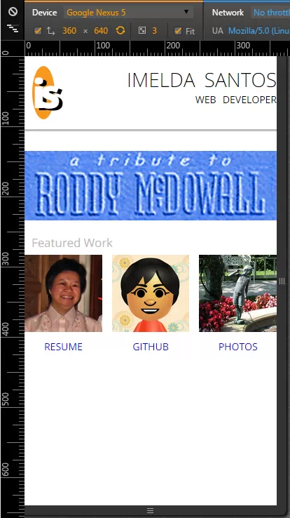
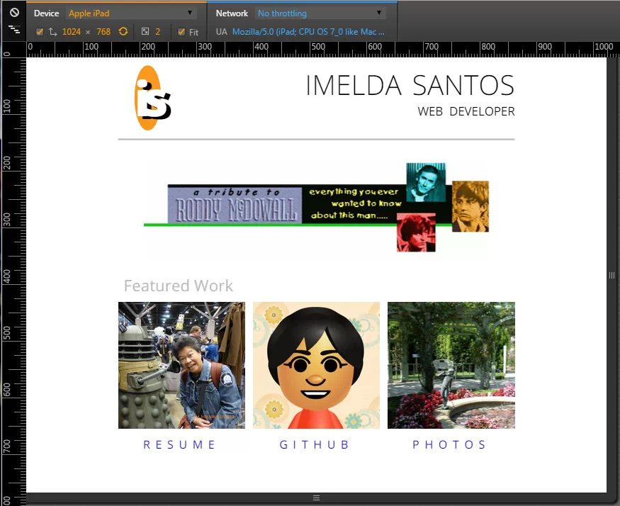
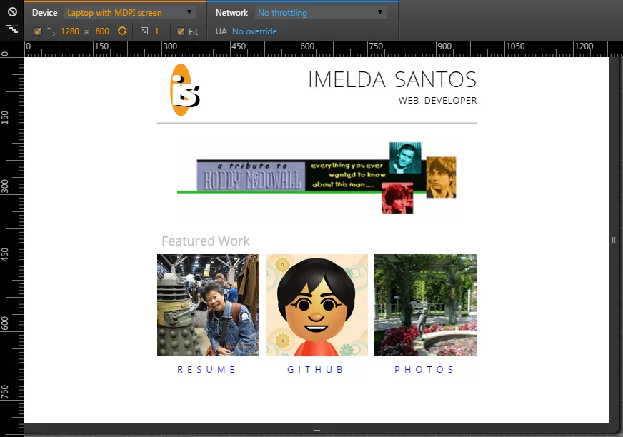

# FEND-build-a-portfolio
Udacity Front-End Web Developer Nanodegree Project 1: Build a Portfolio Site

**Project Overview**

You will be provided a design mockup as a PDF-file and must replicate that design in HTML and CSS. You will develop a responsive website that will display images, descriptions and links to each of the portfolio projects you will complete through the course of the Front-End Web Developer nanodegree.

Once you've successfully replicated the design mockup, you are encouraged to continue tweaking and making customizations to the design to personalize it and make it your own!

**Why this Project?**

The first thing potential employers look for isn’t which school you attended or what your GPA was; they want to see what you’ve built! You need a professional portfolio to show off your skills.

In this project you’ll build a great look portfolio where you can show off images, descriptions and link to all of your projects. You'll do so writing code that conforms to the Udacity Style Guide.

**What will I learn?**

You will learn how HTML is used to define the content of a web page and start to think of every web page as a number of boxes on the screen. You’ll then learn how to position those boxes and make them beautiful using CSS.

You'll accomplish this while conforming to a style guide which is an important constraint once you step into any existing development position.

**Why is this Important to my Career?**

- Without a portfolio, recruiters won’t even look at your resume much less interview you.
- At their very foundation, web applications are just content delivery mechanisms; HTML defines how that language is structured.
- Reading poorly designed content is never an enjoyable experience; CSS empowers you to create beautiful content regardless of your user’s device.

## Screenshots from submitted code that passed the review

